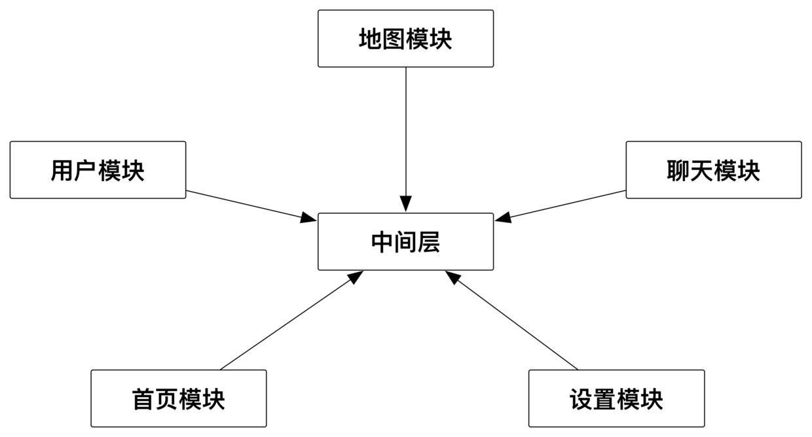

# iOSMainProject

[](https://travis-ci.org/NShunJian/NSMainProject)
[](https://cocoapods.org/pods/NSMainProject)
[](https://cocoapods.org/pods/NSMainProject)
[](https://cocoapods.org/pods/NSMainProject)


- 业务划分更佳清晰，新人接手更佳容易，可以按组件分配开发任务。
- 项目可维护性更强，提高开发效率。
- 更好排查问题，某个组件出现问题，直接对组件进行处理。
- 开发测试过程中，可以只编译自己那部分代码，不需要编译整个项目代码。
- 方便集成，项目需要哪个模块直接通过CocoaPods集成即可。




改进后的架构

进行组件化开发后，可以把每个组件当做一个独立的app，每个组件甚至可以采取不同的架构，例如分别使用MVVM、MVC、MVCS等架构，根据自己的编程习惯做选择。

## Example

要运行示例项目, clone the repo,  run `pod install`.

[跑演示时先添加私有库：](https://github.com/NShunjian/PodSpecs.git)https://github.com/NShunjian/PodSpecs.git
```
pod repo add PrivatePods https://github.com/NShunjian/PodSpecs.git 
```
## Requirements

本工程部分介绍

`Category`目录在实际工程中是单独的一个repo，调用者通过依赖category这个repo来完成功能调度。一般来说是每一个业务对应一个category的repo。因此调用者需要调度哪个业务，就依赖哪个业务的category。category这个repo由对应提供服务的业务来维护。

`CTMediator`目录在实际工程中也是一个单独的repo，仅用于存放中间件。被每一个业务线各自维护的category repo所依赖。

`Target_`目录是实际提供服务的业务，这个在实际工程中也是一个单独的repo。这个repo不被任何人所依赖，这个repo通过target-action来提供被调度的功能，然后由category repo通过runtime调度。

---

- [iOS应用架构谈 组件化方案](http://casatwy.com/iOS-Modulization.html)

- [在现有工程中实施基于CTMediator的组件化方案](http://casatwy.com/modulization_in_action.html)

- [CTMediator的Swift应用](https://casatwy.com/CTMediator_in_Swift.html)

- [组件化架构漫谈](https://www.jianshu.com/p/67a6004f6930)
